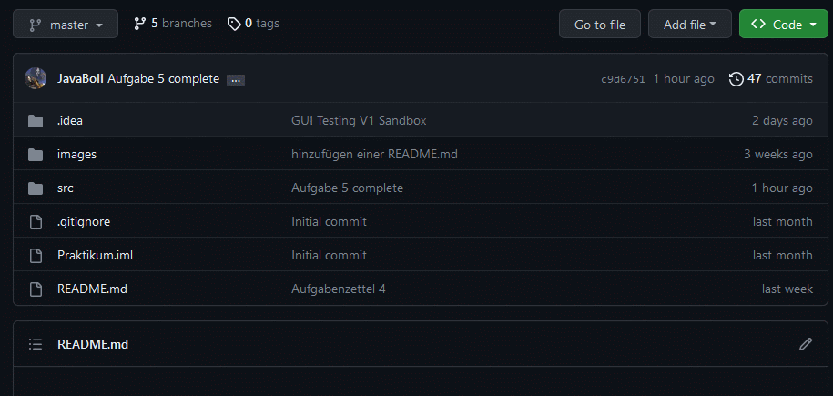

<!-- PROJECT LOGO -->
 

<h3 align="center">Software Praktikum 2</h3>

  

    Hier lade ich meine Software-Abgaben hoch. 
    Ihr könnt diese frei einsehen, herunterladen und für eigene Zwecke verwenden. 
    Bitte bedenkt, die Dateien nicht 1:1 zu kopieren und so zu präsentieren,   
    da ich mithilfe dieser Repository beweisen kann, dass ich der Autor bin.
  

---
<!-- TABLE OF CONTENTS -->
## Inhaltsverzeichnis

- [Inhaltsverzeichnis](#inhaltsverzeichnis)
- [Roadmap](#roadmap)
- [Setup](#setup)
    - [Voraussetzungen](#voraussetzungen)
    - [Installation über Github](#installation-über-github)
    - [Installation über Git Version Control System (VCS)](#installation-über-git-version-control-system-vcs)
- [Updaten mit VCS](#updaten-mit-vcs)
- [Usage](#usage)

---

[//]: # ([![In Bearbeitung]&#40;https://img.shields.io/badge/-in%20bearbeitung-yellow&#41;])

<!-- ROADMAP -->
## Roadmap

- [x] Aufgabenzettel 1 - 
- [x] Aufgabenzettel 2 - 
- [x] Aufgabenzettel 3 - 
- [x] Aufgabenzettel 4 - 
- [x] Aufgabenzettel 5 - 
- [x] Aufgabenzettel 6 - 
- [ ] Aufgabenzettel 7 - 
- [ ] Aufgabenzettel 8 - 

(<a href="#readme-top">back to top</a>)

---

<!-- Setup -->
## Setup

Folge diesen Schritten, um das Projekt lokal zu installieren.

### Voraussetzungen

* Java Development Kit (JDK), Version 8 oder höher
* Eine integrierte Entwicklungsumgebung (IDE), z.B. Eclipse, IntelliJ IDEA, etc.
* Git (optional)

### Installation über Github
 
   1. Klicke auf den grünen Button "Code"  
   2. Klicke auf "Download ZIP"  
   3. Entpacke die ZIP-Datei  
   4. Öffne den Ordner "Praktikum" in deiner IDE  
   5. Klicke auf "**Trust Project**"  
   6. Im _src_ Ordner findest du alle Aufgabenzettel  

 
1. Herunterladen der Repository als ZIP-Datei  
  
2. Entpacken der ZIP-Datei  
  
3. Öffnen des Ordners in der IDE  
  

### Installation über Git Version Control System (VCS)
 
1. Klicke auf den grünen Button "Code"  
2. Kopiere den Link (Bspsw. https://github.com/User/Repository.git)  
3. Öffne deine IDE und klicke auf "**Get from VCS**"  
4. Füge den Link ein und klicke auf "**Clone**"  
5. Klicke auf "**Trust Project**"  
6. Im _src_ Ordner findest du alle Aufgabenzettel  

 
1. Kopieren des Links  
  
2. Projekt über VCS öffnen  
  
3. Wenn du das Projekt in der IDE updaten möchtest, gehe zum Abschnitt
* [Updaten](#Updaten-mit-VCS)

(<a href="#readme-top">back to top</a>)

---

<!-- Updaten -->
## Updaten mit VCS
 
1. Klicke Oben links auf "**master**"  
2. Klicke auf "**Update Project**"  
3. Klicke auf "**OK**"  
4. Projekt ist geupdatet  

 
1. Projekt Updaten  
  
2. Projekt ist geupdatet  

(<a href="#readme-top">back to top</a>)

---

<!-- USAGE EXAMPLES -->
## Usage

Unter [Praktikum/src/](https://github.com/JavaBoii/Praktikum/tree/master/src) findet ihr alle Aufgabenzettel. 
In diesen Unterordnern findet ihr die .java-Datei. Diese könnt ihr in jedem Texteditor öffnen und den Code herauskopieren.
Oder die Datei direkt in der IDE eurer Wahl einfügen. 

(<a href="#readme-top">back to top</a>)

